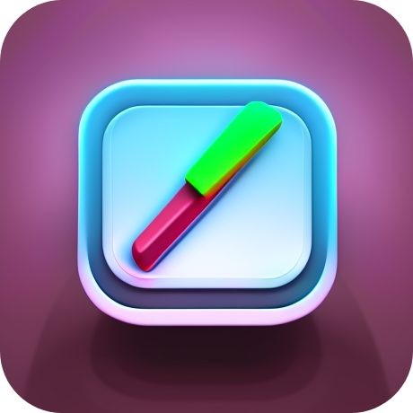

# Remembrall To-Do



[](https://github.com/prettier/prettier)

Welcome to the Remembrall To-Do repository! This is a simple, yet powerful to-do app that allows you to categorize your tasks by importance, and receive notifications based on their priority level. Designed to help you stay organized and focused on what matters most.

## Project Description

Remembrall To-Do is a to-do application that lets users create and manage tasks based on five priority levels:

1. Extremely Important
2. Very Important
3. Important
4. Normal
5. Low

You can customize the frequency of notifications for each priority level, ensuring that you're reminded about your tasks and notes when you need to be.

## Built With

- [Node](https://nodejs.org/)
- [React Native](https://reactnative.dev/)
- [Prettier](https://prettier.io/)

## Screenshots


## Getting Started

To get started with Remembrall To-Do, follow these steps:

1. Clone the repository:

```
git clone https://github.com/Max-Montag/Remembrall-To-Do.git
```

2. Change to the project directory:

```
cd Remembrall-To-Do
```

3. Install the necessary dependencies:

```
npm install
```

4. Start the development server:

```
npx react-native start
```

4. Start on Android:

```
 npx react-native run-android
```
